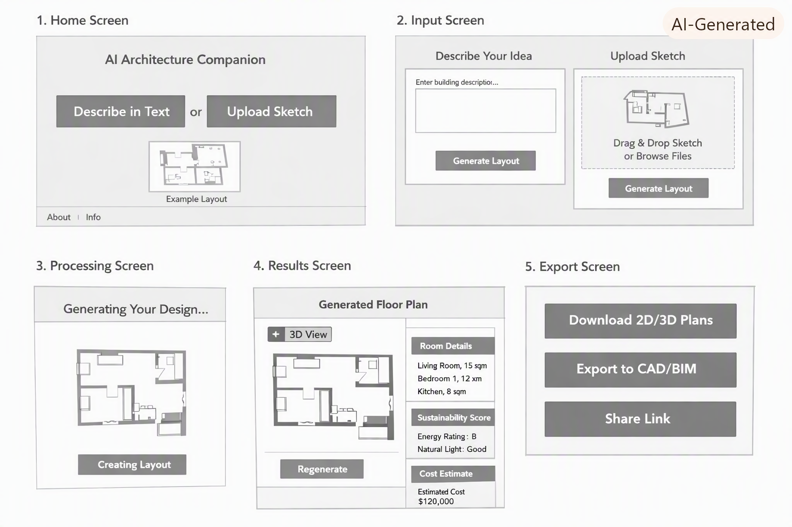
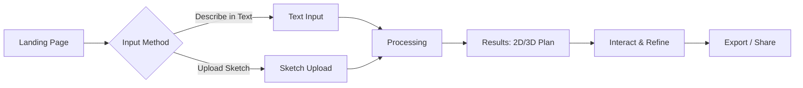

# 🏗️ AI Architecture Companion

An AI-powered tool that generates architectural floor plans from text descriptions or hand-drawn sketches. Built to accelerate the early-stage design process for architects, homeowners, and builders.

## ✨ Features

| Feature | Description |
|---|---|
| 🗣️ **Text-to-Plan** | Describe your building idea in natural language and get a floor plan |
| 📸 **Sketch-to-Plan** | Upload a hand-drawn sketch (PNG/JPG/PDF) and let AI interpret it |
| 📐 **2D & 3D Views** | Toggle between 2D floor plans and immersive 3D models |
| ♻️ **Sustainability Score** | Automatic light, ventilation, and energy efficiency analysis |
| 💰 **Cost Estimate** | Ballpark construction cost based on layout and materials |
| 🎨 **Style Switcher** | Flip between modern, rustic, minimalist, and more |
| 🔄 **Regenerate** | Instantly try new layout variations |
| 📤 **Export** | Download as PNG/SVG, export to CAD/BIM, or share via link |

## 🖼️ Wireframes



## 🧭 User Flow



## 🛠️ Tech Stack (Planned)

- **Frontend:** React / Next.js
- **3D Rendering:** Three.js
- **AI/ML:** LLM for text-to-plan, Computer Vision for sketch interpretation
- **Backend:** Python (FastAPI) or Node.js
- **Export:** SVG.js, IFC.js (BIM)

## 🚀 Getting Started

> ⚠️ This project is in early design / prototype phase.

```bash
# Clone the repo
git clone https://github.com/stevenmuganwa/architecture_companion.git
cd architecture_companion

# (Coming soon)
# npm install
# npm run dev
```

## 📁 Project Structure

```
architecture_companion/
├── README.md
├── wireframe_outline.md      # Screen-by-screen wireframe spec
├── wireframes.png            # Visual wireframes
└── (app source — coming soon)
```

## 📝 Roadmap

- [ ] Set up Next.js frontend scaffold
- [ ] Build Landing & Input screens
- [ ] Integrate LLM for text-to-plan generation
- [ ] Add sketch recognition pipeline
- [ ] Build 2D canvas renderer
- [ ] Add 3D toggle with Three.js
- [ ] Sustainability scoring engine
- [ ] Cost estimation module
- [ ] Export to PNG/SVG/CAD/BIM
- [ ] Collaborative sharing

## 📄 License

MIT
